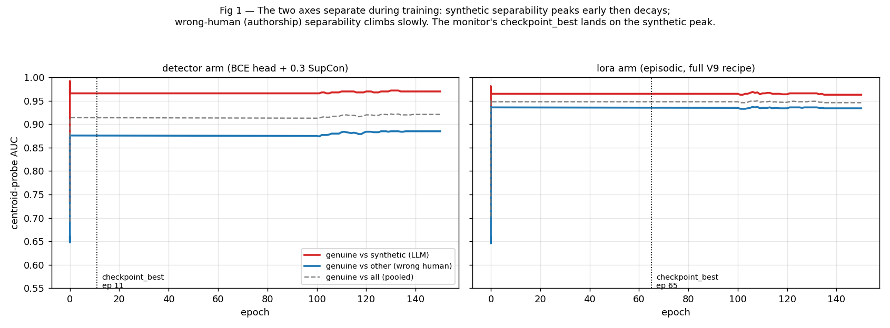
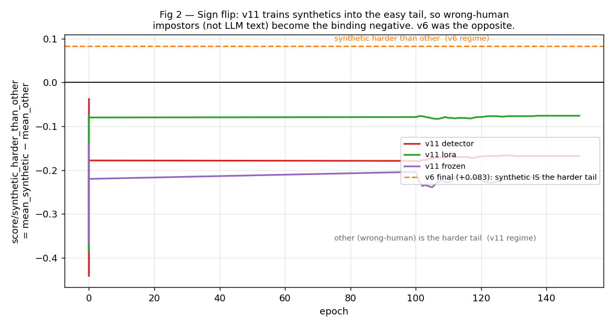
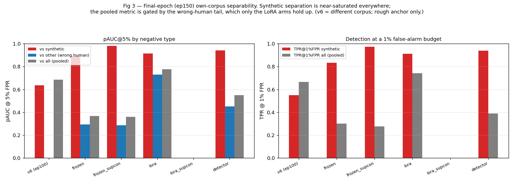

# V11 Results Analysis — what changed since v6, what the ablation tests, and how to read the numbers

*Drafted 2026-06-11 while the run is still in progress. Companion to the design
draft `docs/v11_synv1_memo.md` (pre-run) and the lineage memos
`docs/v9_lineage_memo.md` / `docs/v9_lineage_results_analysis.md`. Figures in
`results/v11/figures/` (regenerate with `python scripts/_v11_memo_figs.py`).*

---

## 0. Status and what these numbers are (read this first)

This memo reasons about the **per-epoch W&B summaries** of the v11 arms, not the
post-hoc ablation JSONs — `results/v11/ablate_common_*.json` **do not exist
yet** because the run is still in its training phase. Three consequences, all of
which I carry through every comparison below:

1. **The v11 numbers are epoch-150 (last-epoch) centroid-probe metrics on each
   arm's *own* corpus** (`enron_shortmail` + `enron_synthetic_v1`). They are not
   the `checkpoint_best` numbers and not the common-corpus ablation the run will
   eventually print. Where `checkpoint_best`'s monitor peak differs materially I
   say so (it almost always does — see §5.1).
2. **The v6 reference** (`/workspace/stylometry_dan/runs/v6_luar_lora_syn/2026-06-01_20-34-34`)
   is its epoch-100 W&B summary on **its own, different corpus** (full-length
   `enron` + the original `enron_synthetic`, no short mail). v6↔v11 here is
   therefore a *rough anchor, not an apples-to-apples comparison*. The
   apples-to-apples row is the pending `ablate_common_*` (both scored on
   `enron_shortmail` + syn-v2); §6 says how to read it when it lands.
3. **`lora_supcon` is still training** (≈ epoch 94/150 at the time of writing) —
   its row is blank everywhere. The other four arms (frozen, frozen_supcon,
   lora, detector) finished 150 epochs.

The whole analysis sits on top of the central finding from the 2026-06-10
lineage run, which is worth restating because it is *why v11 exists*:

> The single embedding is being asked to do two jobs that pull it apart —
> **"reject LLM-generated text"** and **"identify the human author"** — and the
> `pauc/genuine_vs_synthetic_5pct` checkpoint monitor only watches the first.
> In the lineage, v9's monitor picked **epoch 10/150**, a checkpoint that
> detects LLM text beautifully and accepts **59.5 % of wrong-sender real-human
> emails** at its operating threshold. No single v9 checkpoint was good at both.
> (`docs/v9_lineage_results_analysis.md` §0; memory `lineage-v9-checkpoint-goodhart`.)

v11 is the structured response to that: separate the two jobs (the **detector**
arm gives "reject LLM-ness" its own classification head), and cleanly attribute
the v8→v9 gains by removing the cross-register-LLM-positive confound (the
**lora/frozen** arms). Everything below is in service of those two questions.

---

## Part A — What changed in the repo since the v6 checkpoint

The v6 checkpoint's `config.yaml` is dated 2026-05-29; HEAD is `c38fd2b`. Between
them sit the v7→v11 recipe changes *and* a substantial rewrite of how models are
selected and evaluated. I split these into model/training (A.1) and evaluation
(A.2) because, as §5 shows, **most of the apparent "result differences" are
actually evaluation differences** — the v6 summary simply did not measure the
quantities that dominate the v11 story.

### A.1 Model, loss, and training changes

| Knob | v6 (2026-06-01 ckpt) | v11 family | Why it changed |
|---|---|---|---|
| LoRA target modules | `query`, `value` | `query`, `value`, **`key`** | +key gives attention one more place to encode *stylistic* (not topical) structure (v6→v7 step, lineage §2) |
| `episode_k` (pooling width) | **4** | **1** | v9 change: embed emails the way enrollment/inference actually use them — one email at a time. K=4 trains on a distribution you never see at test. |
| Loss | `supcon`, τ=**0.07** | `episodic` (variable-K′), τ=**0.05** — *or* `supcon` τ=0.05 (the `_supcon` arms) *or* `llm_detector` (BCE) | τ↓ upweights near-anchor (hardest) negatives; episodic builds per-episode prototypes; the BCE head is the new decoupled detector (A.1a) |
| `n_syn_per_batch` | **2** | **4** | doubles how often a real↔synthetic contrast appears per batch (more gradient on the adversary) |
| Backbone | LoRA (always trainable) | LoRA **or frozen** (`freeze_backbone: true` arms) | new ablation axis: how much of v11 is backbone adaptation vs. a re-shaped projection of a fixed LUAR space |
| Corpus | `enron` (full-length) | `data/processed/enron_shortmail` (short mail present, signatures kept, floors lowered) | v9 distribution change: production traffic is short; the old corpus had a "short-query cliff" |
| Synthetic set | `enron_synthetic` | `enron_synthetic_v1` (438 rows, **100 % `__syn` hard negatives, 0 cross-register positives**) | the clean ablation corpus (see Part B) |
| Augmentation | none | `crop_prob: 0.3` (5–60 words) + `register_stratified: true` | LLM-free length & register invariance — replaces v8's cross-register *LLM positives* with real-text signal |
| Batch size | 64 | 128 | larger batch = more in-batch negatives for the contrastive losses |
| LR | 2e-4 | 2e-4 (LoRA arms) / **1e-3** (frozen arms) | frozen arms train ~1000× fewer params (projection only), so the LR is raised to match `v6_luar_frozen.yaml` |
| Epochs | 100 | 150 | the hard-tail separation emerges late |
| Hard-negative mining | **off** | **on** (warmup 20, ramp 30, interval 5, ≤50 % hard) | actively mines the closest cross-sender pairs each interval (logs show it repeatedly surfacing `germany-c`/`nemec-g`, `whalley-g`/`whalley-l`) |
| Scoring head | none declared (default) | `prototypical` head, `score_fn: adaptive_k`, four `eval_score_fns` logged every epoch | makes per-epoch curves directly comparable across arms |
| **Checkpoint monitor** | **`val/loss` (default, min)** | **`pauc/genuine_vs_synthetic_5pct` (max)** | this is the single most consequential change — see §5.1 and A.2 |

#### A.1a The new `llm_detector` loss and the code it required

`src/email_fraud/losses/llm_detector.py` (new) is a single
`nn.Linear(128, 1)` head on the pooled embedding, trained with
`BCEWithLogitsLoss` to predict human(0) vs LLM(1). The label is read straight off
the `__syn` suffix every synthetic hard negative already carries; per-batch
`pos_weight = n_neg/n_pos` corrects the synthetic-minority imbalance (4 of 16). A
0.3 SupCon auxiliary keeps the embedding sender-clustered so the centroid probe
and the lineage monitor stay meaningful.

Because a loss now *owns trainable parameters*, four small but real plumbing
changes were needed (working-tree diff, `trainer.py` / `train.py` /
`losses/__init__.py`):

- `Trainer` moves `loss_fn` to the device and folds
  `loss_fn.parameters()` into the AdamW group (it logs "Optimizing N extra
  parameter tensors from the loss").
- The checkpoint now persists `loss_state_dict` and restores it on resume, so the
  trained detector head survives reloads (empty dict for param-less losses).
- `train.py` passes `embedding_dim = cfg.encoder.projection_dim` into the loss
  ctor (filtered out for losses that don't accept it).

#### A.1b One invariant turned into code

`train.py` now passes `SyntheticAugmentedDataset(..., llm_negatives_only=True)`
**explicitly**. This drops any synthetic row stored under a real `sender_id` at
load time — *LLM text is only ever a hard negative, never a positive*. This is
the change that **reverses the v8 endorsement of cross-register LLM positives**
(CHANGELOG 2026-06-11): storing an LLM impersonation inside the author's cluster
teaches the encoder that a convincing forgery belongs there, which opposes the
fraud signal. (syn-v1 has no positives on disk anyway, so the guarantee holds at
three layers: data, loader, sampler.)

### A.2 Evaluation changes — the part that reshapes the story

The v6 summary and the v11 summaries are not measuring the same things. The
2026-06-09→06-11 work rebuilt the eval harness around the failure modes the
lineage exposed. What is new relative to the v6 checkpoint:

1. **The CentroidProbe was split by negative type.** v6 logged a pooled
   `auc/genuine_vs_all` and a generic `test/TPR@FPR`. v11 logs three separate
   tracks every epoch — **genuine-vs-synthetic** (LLM text), **genuine-vs-other**
   (wrong human), and **genuine-vs-all** (pooled) — for AUC, pAUC@{5,10}%, and
   TPR@{1,5}%FPR. Without this split you cannot *see* the two-objective tension;
   with it, it is the first thing you notice (Fig 1).

2. **Low-FPR operating metrics became first-class.** pAUC restricted to FPR≤5 %
   and TPR at fixed 1 %/5 %/10 % FPR anchors, plus FPR-anchored operating points
   (`op/<pool>/fpr_X` → recall, precision, threshold). These answer the
   deployment question ("at a 1 % false-alarm budget, what fraction do we catch?")
   that a full-range AUC hides.

3. **An anti-Goodhart composite monitor.** `pauc/min_other_synthetic_5pct` =
   the *worse* of the two impostor tails. The lineage showed monitoring the
   synthetic tail alone slides checkpoint selection to the LLM-detector extreme;
   the composite refuses to call a checkpoint good unless *both* tails are.

4. **The wrong-sender tail was made explicitly visible (working-tree diff).**
   `scripts/train.py`/`centroid_probe.py` now also log `tpr_at_fpr/other_1pct`,
   `tpr_at_fpr/other_5pct` and `op/other/fpr_*`, and the per-epoch console prints
   a `tpr@1%fpr  other= … syn= … all=` line. The diff comment says it plainly:
   *for the v11 family the pooled `all_1pct` point is set by the other-sender tail,
   not synthetics* — so it must be readable directly, not inferred from the AUC.

5. **Two evaluation corpora per arm + scorer ablation with bootstrap CIs.**
   `ablate_own_*` scores each checkpoint on its own corpus (syn-v1, parity with
   history); `ablate_common_*` scores every checkpoint on the shared
   production-like corpus (`enron_shortmail` + syn-v2) — *the* apples-to-apples
   lineage comparison. Each sweeps K∈{4,8,16,25} and four scorers with 1000-sample
   bootstrap CIs (`scripts/ablate_adaptive_scorers.py`).

6. **A sliced OOD harness** (`scripts/eval_ood.py`, `build_ood_eval.py`):
   pairwise verification metrics on **unseen test senders**, sliced by length
   (short/medium/long/mix) and register (cross/same) — to measure directly
   whether crop-aug + register-stratified sampling bought length/register
   invariance, rather than inferring it.

7. **Checkpoint selection itself changed** (A.1, last row): v6's `checkpoint_best`
   tracked **`val/loss`** (the legacy default — the old config sets no monitor),
   which is blind to the synthetic/other split entirely. v11 monitors a
   low-FPR pAUC. This alone makes the two `checkpoint_best.pt` files
   incomparable in kind, which is exactly the comparability problem the lineage
   rebuild set out to fix.

---

## Part B — What the v11 ablation is testing

### B.1 The confound it resolves

`docs/v9_lineage_memo.md` §3 flags that the headline "v9 is best" bundles **three**
simultaneous changes from v7: (a) a regenerated synthetic corpus + quality
filter, (b) **cross-register LLM positives** (syn-v2's 264 LLM emails stored
under *real* sender ids, as positives), and (c) the episodic objective +
short-mail distribution. Nothing in the lineage isolates the *objective/
distribution* change (c) from the *cross-register-data* change (b).

**v11 is the missing cell.** Every arm runs the full V9 recipe (episodic
variable-K′, `episode_k=1`, batch 128, `enron_shortmail`, crop aug) but points
at **`enron_synthetic_v1` — 438 rows, 100 % hard negatives, zero cross-register
positives**. Read against the lineage's v9 (same recipe on syn-v2), the
**v11-lora ↔ v9 gap is exactly the cross-register-positive contribution**; the
**v11-lora ↔ v7 gap is the episodic-objective + short-mail contribution**, now
cleanly separated.

### B.2 The five arms (a clean 2×2 + a decoupled detector)

| Arm | Backbone | Loss | Isolates |
|---|---|---|---|
| **frozen** | LUAR **frozen** | episodic | the V9 recipe with *no backbone adaptation* — projection-only |
| **frozen_supcon** | LUAR frozen | supcon (episode_k=1) | the **episodic-loss contribution under a frozen backbone** (vs frozen: only the loss differs) |
| **lora** | LUAR + LoRA | episodic | the clean "v8→v9 objective+distribution, minus cross-register data" cell |
| **lora_supcon** | LUAR + LoRA | supcon (episode_k=1) | the **episodic-loss contribution under LoRA** (vs lora: only the loss differs) — *still running* |
| **detector** | LUAR + LoRA | **`llm_detector` BCE** + 0.3 SupCon | the **decoupled LLM-detector** — the answer to the two-objective tension |

So the design answers four questions at once: *does the backbone need to move?*
(frozen ↔ lora), *is the episodic loss earning its complexity?* (each
`_supcon` sibling holds episode_k=1 fixed and flips only the objective), *what
did the cross-register positives actually buy?* (v11-lora vs lineage-v9), and
*does giving "reject LLM-ness" its own head beat making one embedding do both?*
(detector vs the rest).

---

## Part C — Results, broken down

### Headline table (epoch-150, own corpus — caveats in §0)

| Metric (ep150, own corpus) | v6\* | frozen | frozen_supcon | lora | detector |
|---|---|---|---|---|---|
| AUC genuine-vs-**synthetic** | 0.885 | 0.992 | **0.999** | 0.963 | 0.970 |
| AUC genuine-vs-**other** | 0.927 | 0.866 | 0.853 | **0.934** | 0.885 |
| pAUC@5% vs synthetic | 0.636 | 0.896 | **0.982** | 0.915 | 0.941 |
| pAUC@5% vs **other** | n/a | 0.293 | 0.285 | **0.729** | 0.450 |
| pAUC@5% vs all (pooled) | 0.684 | 0.367 | 0.359 | **0.777** | 0.549 |
| TPR@1%FPR synthetic | 0.55 | 0.833 | **0.973** | 0.913 | 0.940 |
| TPR@1%FPR **all (pooled)** | 0.667 | 0.299 | 0.277 | **0.742** | 0.390 |
| TPR@5%FPR all (pooled) | 0.808 | 0.538 | 0.519 | **0.848** | 0.708 |
| `synthetic_harder_than_other` | **+0.083** | −0.216 | −0.279 | −0.076 | −0.168 |
| monitor peak (`checkpoint_best`) | ep≈100 (val/loss) | ep40 | ep78 | ep65 | **ep11** |

\* v6 = epoch-100, own (different) corpus. Rough anchor only — see §0.

The shape of this table is the whole story: **synthetic separation is
near-saturated for every v11 arm** (AUC 0.96–0.999, vs v6's 0.885), while the
**wrong-human (other) tail is now the binding constraint** and only the LoRA
arms hold it up. Figures 1–3 explain why.

### 5.1 Fig 1 — the two axes separate, and the monitor lands on the easy one



`fig1_training_dynamics.png` plots the three centroid-probe AUCs over training
for the detector and lora arms. Two things are visible:

- **Synthetic separability (red) saturates almost immediately** — by epoch ~1–5
  both arms are at AUC ≈ 0.96–0.98 against LLM text and stay there. This is the
  lineage's "LLM-ness is an *easy, global* axis" result reproduced: one generator
  (Mistral-7B) wrote every synthetic, so a near-linear boundary separates it from
  human text right away. (In the lineage's v9 this axis then *decayed* as capacity
  reallocated to authorship; here crop-aug + hard-neg mining + the explicit
  detector objective keep it pinned near the ceiling instead.)
- **Wrong-human separability (blue) is lower and rises slowly** — and the gap
  between the arms lives here, not on synthetic. The detector's other-AUC sits at
  ~0.88; lora's climbs to ~0.93. Authorship is the hard part, and it is what
  takes the full 150 epochs.

The dotted line is `checkpoint_best` (the monitor peak). For the **detector arm
it is epoch 11** — because the monitor (`pauc/genuine_vs_synthetic_5pct`) watches
the *centroid-probe* synthetic axis, which is at the ceiling within ten epochs.
This is the exact Goodhart the lineage memo warned about, and it has a sharp
caveat for the detector arm specifically: **the monitor does not even watch the
thing the detector arm optimizes** (the BCE logit). The BCE head is monotonic by
construction; the centroid probe it is monitored on is not. So `checkpoint_best`
for the detector arm is selected on a quantity orthogonal to its real output —
when its evals land, score the **logit**, and prefer `checkpoint_last` or the
composite monitor. (For frozen/lora the peak is later — ep40–65 — because their
*other* axis is still moving when synthetic saturates, dragging the monitor's
own pAUC up for longer.)

### 5.2 Why `synthetic_harder_than_other` flipped sign (Fig 2)



By definition (`scoring/metrics.py`):

```
synthetic_harder_than_other = gap_other − gap_synthetic = mean_synthetic − mean_other
```

where `gap_X = mean_genuine − mean_X`. Positive ⇒ synthetics score *closer to
genuine* (higher) than wrong-human mail ⇒ **synthetics are the harder negative**.
Negative ⇒ synthetics are pushed *further* than wrong-human mail ⇒ **wrong-human
mail is the harder negative**.

- **v6: +0.083** — synthetics scored slightly higher than other. With only n_syn=2,
  τ=0.07, no hard-neg mining and no detector objective, v6 never fully learned to
  reject LLM text, so LLM mimics still drifted near genuine clusters.
- **v11: −0.08 (lora) to −0.28 (frozen_supcon)** — every arm flips negative, and
  `fig2_harder_than_other.png` shows it happen within the first epoch and stay
  there. v11 trains *hard* against synthetics (n_syn 4, τ 0.05, hard-neg mining,
  and for the detector arm a head whose entire job is "push LLM text away"), so
  the synthetic mean collapses toward 0. Meanwhile **crop-aug + register-stratified
  sampling deliberately make the genuine/other problem harder** — same-author
  cross-register and short crops pull genuine and other-human closer together.
  Net: synthetics become the trivial tail, wrong-human mail becomes the binding
  one. **The sign flip is not a regression — it is the recipe working as
  designed.** It is the per-arm, single-number echo of the lineage's
  "two-objective tension," and it is exactly why the eval harness now logs the
  *other* tail explicitly (A.2 #4).

A subtlety worth flagging: this metric is about **mean score separation**, not
ranking. v6 has `other`-AUC (0.927) > `synthetic`-AUC (0.885) yet
`harder = +0.083`; mean-gap and AUC can disagree because one synthetic outlier
near the genuine mean moves the mean without moving the rank-based AUC much.
Read the two together, not either alone.

### 5.3 TPR@FPR — why the pooled rate is gated by the wrong-human tail

The TPR@FPR differences fall straight out of §5.1–5.2:

- **TPR@1%FPR_synthetic rises across the board** (v6 0.55 → frozen_supcon 0.973,
  detector 0.94, lora 0.91). At a tight 1 % false-alarm budget v11 catches almost
  all LLM forgeries; v6 caught barely half. This is the n_syn↑ / τ↓ / mining /
  detector-head pressure concentrated exactly where the lineage said gains live —
  the hard low-FPR tail, not the AUC.
- **TPR@1%FPR_pooled ("all") tells the opposite story for most arms**: frozen
  0.299, frozen_supcon 0.277, detector 0.390 — all *below* v6's 0.667. The pooled
  operating point is set by the **hardest** negatives, and (§5.2) those are now
  the wrong-human impostors. A model that aces synthetics but accepts wrong-human
  mail has a pooled 1 % point dominated by the failures. **Only `lora` holds the
  pooled tail up (0.742 > v6's 0.667)** — because only the LoRA-with-episodic arm
  pushed the *other*-AUC up to 0.934 while keeping synthetic high.

This is the v9@ep10 failure (accepts 59.5 % of wrong-sender mail) showing up in
the v11 metrics — but now *visibly*, because the harness reports
`tpr_at_fpr/other_*` and `op/other/*` instead of hiding it inside a
synthetic-only headline. The two frozen arms and the detector arm are, by this
metric, **LLM-text detectors that are weak authorship verifiers** — which for the
detector arm is the explicit design, and for the frozen arms is the answer to
"can a fixed LUAR space do authorship?" (no, see §5.5).

### 5.4 pAUC — the same split, integrated over the low-FPR region



`fig3_final_comparison.png` puts the pAUC@5% bars side by side.

- **pAUC vs synthetic**: every v11 arm ≫ v6 (0.64). frozen_supcon (0.982) and
  detector (0.941) top it — direct/sharp objectives win the low-FPR synthetic
  region.
- **pAUC vs other**: the divider. lora 0.729 vs frozen 0.293 / frozen_supcon
  0.285 / detector 0.450. A frozen LUAR projection simply cannot resolve
  *same-corpus* human impostors in the bottom 5 % FPR — the discriminative
  capacity for fine authorship distinctions has to come from moving the backbone.
- **pAUC vs all (pooled)**: tracks the *other* column because the pooled low-FPR
  region is dominated by the hard human tail — lora (0.777) is the only arm to
  beat v6's pooled 0.684; the others fall to 0.36–0.55.

Compare to v6's `test/pAUC@5% = 0.393`: even v6's own pooled pAUC was mediocre.
The point of v11's pAUC reporting is not that the number went up — it is that the
number is now *attributable* to a specific negative type.

### 5.5 frozen ↔ lora, and episodic ↔ supcon

- **Backbone adaptation buys authorship, not detection.** frozen→lora barely
  moves synthetic pAUC (0.896→0.915) but transforms the *other* pAUC
  (0.293→0.729) and pooled TPR@1% (0.299→0.742). Rejecting single-generator LLM
  text is a coarse global axis a fixed embedding already exposes; resolving one
  human from another in the low-FPR tail requires the LoRA layers to move. This
  mirrors the v6 frozen-vs-LoRA ablation and answers the arm's headline question
  decisively: **most of v11's *authorship* value is backbone adaptation.**
- **The episodic loss vs supcon verdict is corpus-pending.** At ep150 on the own
  corpus, frozen_supcon edges frozen on synthetic (pAUC 0.982 vs 0.896) but both
  are equally poor on other (~0.29) — i.e. under a frozen backbone the loss choice
  only moves the easy axis. The LoRA comparison (lora vs lora_supcon) is the one
  that matters for "is episodic earning its complexity," and **`lora_supcon` is
  still training** — leave that conclusion for the common-corpus ablation. (Prior:
  the lineage never isolated this; v11 is the first clean read.)
- **The detector arm behaves exactly as designed**: strong synthetic
  (TPR@1% 0.94, pAUC 0.941), weak pooled/other (TPR@1%_all 0.390, other-pAUC
  0.450). It is the *detector half* of the two-model design
  (`docs/v10_two_model_memo.md`); it is **not** meant to be read as an authorship
  verifier, and its centroid-probe monitor (§5.1) under-represents it.

### 5.6 Grounding in the v6→v9 lineage

The v11 results are coherent with — and explained by — the lineage findings:

- **v6→v7 ("train harder against the adversary"): n_syn↑, τ↓, +key, longer.**
  The lineage measured +9–12 pp in the low-FPR synthetic tail with flat AUC. v11
  carries all of these and then some, which is why **every** v11 arm's synthetic
  TPR@1% (0.83–0.97) towers over v6's 0.55. The gain is concentrated in the tail,
  exactly as the lineage predicted.
- **v7→v8 ("cross-register LLM positives"): the lineage found this *regressed*
  on the common corpus (−20 pp TPR@1%) and reasoned that LLM positives erode the
  "reject-LLM-flavored-text" shortcut a single-generator pool rewards.** v11 acts
  on that conclusion by *banning* LLM positives in code (A.1b) and recovering
  register invariance from real text. The v11-lora ↔ lineage-v9 gap, when the
  common-corpus eval lands, will quantify what that ban cost or saved.
- **v8→v9 ("episodic + short-mail"): the lineage's headline v9 win was an
  artifact of the ep10 checkpoint, and v9@ep150 was the best human-impostor
  discriminator we'd seen (other-AUC 0.933) with a collapsed synthetic tail.**
  v11-lora's ep150 other-AUC (0.934) reproduces that "best authorship" result on
  the clean no-positive corpus — confirming the authorship gain was the
  objective+distribution change (c), **not** the cross-register data (b). And the
  v11 monitor-peak epochs (detector ep11, lora ep65) reproduce the Goodhart
  directly: the synthetic-only monitor still wants to stop early.

**Bottom line of the grounding:** v11 is not a fresh direction — it is the
lineage's own diagnosis turned into an experiment. The metrics behave the way
the lineage said they would, which is the strongest evidence that the diagnosis
(two objectives, one space, a monitor that watches only one) was correct.

---

## 6. How to read the run when it finishes

1. **Use `ablate_common_*.json` (syn-v2, `enron_shortmail`) for any v6/v7/v8/v9
   ↔ v11 claim.** The own-corpus numbers in this memo are directional; the common
   corpus is the only fair lineage comparison. Drop the common-corpus rows into
   `docs/v9_lineage_memo.md` §5 next to v7/v8/v9.
2. **Always quote `FPR_other` / `tpr_at_fpr/other_1pct` next to the synthetic
   number** (the memory note's standing rule). The synthetic headline is
   saturated and no longer discriminating; the *other* tail is where arms differ.
3. **For the detector arm, score the BCE logit, not the centroid probe**, and
   prefer `checkpoint_last` (or the composite monitor) over its ep11
   `checkpoint_best` — its monitor watches an axis orthogonal to its output (§5.1).
4. **Settle "is episodic earning its complexity" only after `lora_supcon`
   finishes** — it is the one controlled flip that isolates the loss under LoRA.
5. **Watch the sliced OOD eval** (`ood_*.json`): it is the only measurement of
   whether crop-aug + register-stratified sampling actually bought
   length/register invariance on *unseen* senders, rather than on the training
   distribution.

*Figures regenerate from the run logs + W&B summaries via
`python scripts/_v11_memo_figs.py` → `results/v11/figures/`.*
